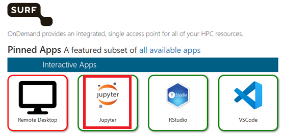
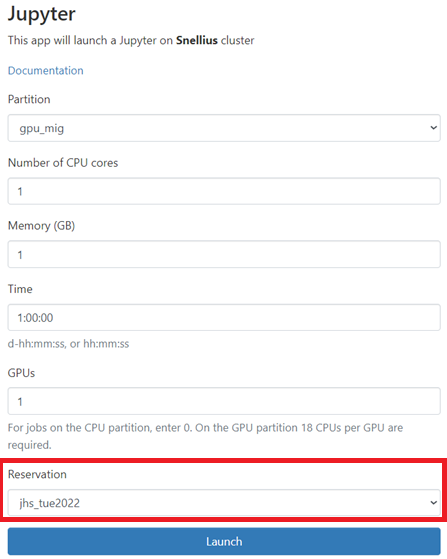

# snellius introduction

## Launch Jupyter notebook on Snellius

- Go to [ondemand](https://ondemand.snellius.surf.nl/) and login with your Snellius credentials
- Go to Jupyter tile

- Launch from GPU partition 
- CPU number and memory do not matter
- GPU number does matter
- You can use the reserved nodes (jhs_tue2022) for free (only gpu_mig) from reservation

- Start notebook (test_gpu_pytorch_mnist.ipynb) or create notebook

## Submit example job

Schedule job

        sbatch example.sh

You can see the status of your job with the following command

        squeue

When the job is running, a output file will spawn called: jupyter_%x_%j.out. Read it with:

        slurm_output_%A.txt

## Submit exercise job

Have a look at the python script and the slurm job

        cat gpu_pytorch_mnist.py
        cat exercise.sh

Schedule job on reserved node

        sbatch exercise.sh

Follow the status of the job

        squeue

When the job is finished, check out the output file

        cat %x_%j.out

